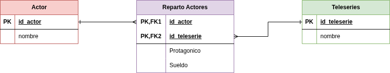

# Ejercicio Final Módulo 5

_Parte 2 de la evaluación . La Primera parte está en el documento ejercicio.sql_

#### Datos que tenemos 📜 :

-Tenemos tres tablas vacías
-Esta Nueva entidad relación se crea porque la relación de las tablas del ejercicio anterior , estaba desnormalizada porque repetía la información.

ASí quedan las nuevas tablas

-ACTORES
-REPARTO_ACTORES
-TELESERIES

Normalizaremos de acuerdo a la base de dato anterior de teleseries y actores y la base de datos está representada en este diagrama:

Las llaves foráneas en reparto_actores 🔑:
La clave primaria compuesta en reparto_actores evita duplicar la misma pareja actor–teleserie.

Este nuevo modelo de tablas normalizado esta dado a :

-Un actor puede participar en muchas teleseries:

-Una teleserie tiene muchos actores.

Relación: Muchos a Muchos (N:M)

Por eso existe la tabla intermedia:REPARTO_ACTORES
